```mermaid
flowchart LR
  Start([Start]) --> InitConfig["Load default config\n(make_default_config)\nexport_config_for_agent"]
  InitConfig --> AskInit["Call GPT: ask_gpt_for_initial_plan\n(generate base_config + priority_keys)"]
  AskInit --> ApplyBase["Apply base_config to current_config\n(only known keys)"]

  ApplyBase --> ForEachParam{"For each priority_key\n(max 3)"}
  ForEachParam --> ParamStart["Set param_best_* defaults\n(start inner rounds)"]

  subgraph OneParamCycle [Single-Parameter Loop]
    ParamStart --> InnerRoundStart["Inner round (1..R)\ntrain_one_round"]
    InnerRoundStart --> Evaluate["Evaluate (stsb evaluator)\nget main_score"]
    Evaluate --> Record["Append history_for_agent\nupdate param/global bests"]
    Record --> AskGPTNew["Call GPT: ask_gpt_for_new_config\n(primary_key mode)"]
    AskGPTNew --> ApplySuggestion["If suggestion contains key:\napply_new_config (only that key)"]
    ApplySuggestion --> AskUser["If not last inner round:\nask user continue? (y/n)"]
    AskUser -->|yes| InnerRoundStart
    AskUser -->|no| ParamEnd
    ParamEnd["End single-parameter loop\nfix best param value into current_config"]
  end

  ParamEnd --> ForEachParam
  ForEachParam -->|no more params| AfterAll["All params done\ncopy best model (optional)"]
  AfterAll --> AskOverall["Call GPT: ask_gpt_for_overall_summary\n(print overall comment)"]
  AskOverall --> End([End])

  classDef startend fill:#f9f,stroke:#333,stroke-width:1px;
  class Start,End startend;
```

说明：

- 节点 `ask_gpt_for_initial_plan` 用于生成初始 `base_config` 与 `priority_keys`；
- 对每个 `priority_key` 执行 1..3 次单变量训练循环（由 `ROUNDS_PER_PARAM` 控制），每轮训练后通过 `ask_gpt_for_new_config` 请求 GPT 在该 key 上给出新值建议；
- 整体结束后会调用 `ask_gpt_for_overall_summary` 输出最终总结，并可将全局最佳模型复制到 `best_overall_model`。
