%%{init: {"themeVariables": {"fontSize": "16px", "edgeLabelBackground":"#ffffff"}}}%%

```mermaid
flowchart LR
  %% 使用中英混合标签，节点文本尽量简短，利于渲染器放大查看
  Start([开始 / Start]) --> InitConfig["加载默认配置\nLoad default config\n(make_default_config)"]
  InitConfig --> AskInit["调用 GPT：初始计划\nask_gpt_for_initial_plan\n(base_config + priority_keys)"]
  AskInit --> ApplyBase["应用 base_config\nApply base_config\n(只覆盖已知键)"]

  ApplyBase --> ForEachParam{"遍历 priority_keys\nFor each priority_key (≤3)"}
  ForEachParam --> ParamStart["设置 param_best 变量\nInitialize param best stats"]

  subgraph SingleParam [单参数循环 / Single-Parameter Loop]
    direction TB
    ParamStart --> InnerRoundStart["内循环第 n 轮\nInner round: train_one_round"]
    InnerRoundStart --> Evaluate["评估（STSb evaluator）\nCompute main_score"]
    Evaluate --> Record["记录历史 history_for_agent\nUpdate param/global bests"]
    Record --> AskGPTNew["调用 GPT：本轮建议\nask_gpt_for_new_config (primary_key)"]
    AskGPTNew --> ApplySuggestion["如果返回包含该键：\n应用建议（仅该键）\napply_new_config"]
    ApplySuggestion --> AskUser["若非最后轮次：询问用户是否继续\nAsk user to continue? (y/n)"]
    AskUser -->|是 / yes| InnerRoundStart
    AskUser -->|否 / no| ParamEnd
    ParamEnd["本参数三轮结束 / Fix best value\nFix best param value into current_config"]
  end

  ParamEnd --> ForEachParam
  ForEachParam -->|全部参数完成| AfterAll["全部参数调参完成\nAll params done"]
  AfterAll --> CopyBest["复制最佳模型（可选）\nCopy best model to best_overall_model"]
  CopyBest --> AskOverall["调用 GPT：整体总结\nask_gpt_for_overall_summary\n(print overall comment)"]
  AskOverall --> End([结束 / End])

  classDef startend fill:#e6ffed,stroke:#2a7a2a,stroke-width:1px;
  class Start,End startend;
```


渲染建议（若要把图导出为较大图片）：

- 使用 `mmdc`（Mermaid CLI）渲染 Markdown 中的 Mermaid 图到 SVG/PNG：

```powershell
# 先全局安装或在虚拟环境中安装 mermaid-cli
npm install -g @mermaid-js/mermaid-cli

# 渲染为 SVG（增大分辨率或宽度以利于查看）
mmdc -i flowchart_bilingual.md -o flowchart_bilingual.svg -w 1600

# 渲染为 PNG（可以指定宽度）
mmdc -i flowchart_bilingual.md -o flowchart_bilingual.png -w 1600
```

- 如果你希望我直接在仓库中生成 `flowchart_bilingual.svg`（需网络/CLI 支持），我可以继续尝试；否则上面命令可在本地执行以得到更大尺寸图片。
